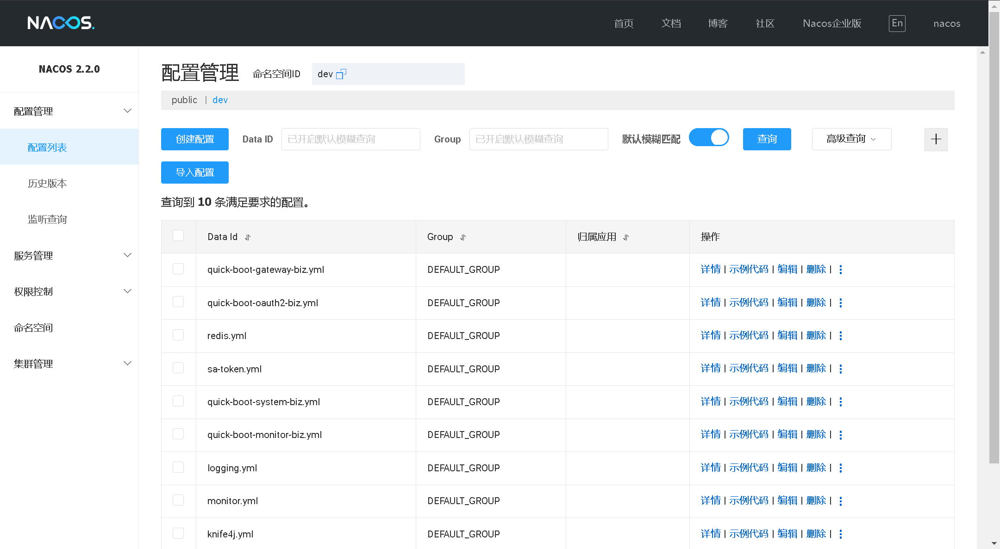
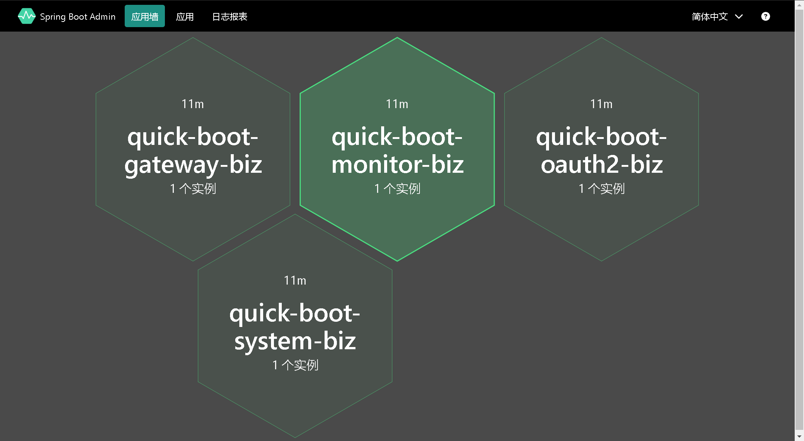
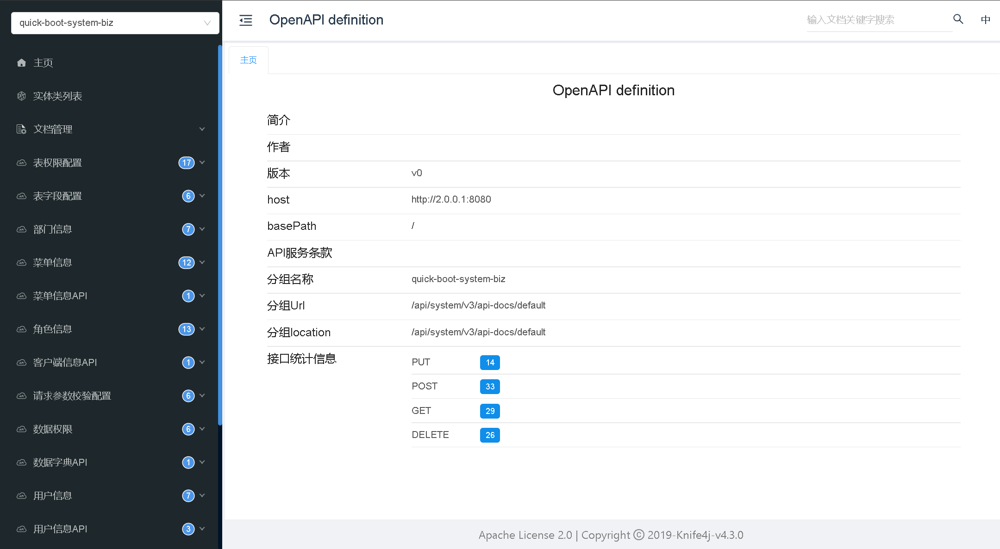

# quick-boot

源码下载
-----------------------------------

| 源码           | 源码地址                                    | 
|--------------|-----------------------------------------|
| 后台源码 JAVA    | https://github.com/csx-bill/quick-boot  |
| 前端源码 `React` | https://github.com/csx-bill/quick-admin |
| 演示站点账号       | http://118.89.55.165  admin/123456      |

## 概述

本文将介绍一种基于 Spring Cloud 2022 、Spring Boot 3、AMIS 和 APIJSON 的低代码系统的设计和实现。该系统可以帮助企业快速开发和部署高质量的 Web 应用程序。我们将首先介绍 AMIS 和 APIJSON 的概念和特点，然后阐述该系统的优点和实现方法。

## AMIS 概述

AMIS 是一种基于 React 技术栈的前端低代码框架。它提供了丰富的组件和模板库，可以快速构建各种类型的 Web 应用程序。AMIS 的优点包括：

- 高度可定制：AMIS 提供了丰富的配置选项和组件接口，可以轻松地根据具体业务需求进行定制。
- 易于扩展：AMIS 的组件库非常丰富，而且可以轻松地进行二次开发和扩展。
- 代码生成：AMIS 提供了一种基于配置的代码生成器，可以根据业务需求自动生成前端代码。

## APIJSON 概述

APIJSON 是一种基于 JSON 数据格式的 API 定义语言。它可以根据 API 接口定义自动生成对应的前端和后端代码。APIJSON 的优点包括：

- 减少重复代码：APIJSON 可以自动生成大部分 CRUD 操作的代码，减少开发人员的重复劳动。
- 减少出错率：APIJSON 可以根据 API 接口定义自动生成代码，避免手写代码带来的错误。
- 易于维护：APIJSON 的 API 接口定义可以直接作为文档使用，方便团队协作和维护。

## 低代码系统的实现

我们将基于 AMIS 和 APIJSON 的优点，设计一种低代码系统，可以帮助企业快速构建和部署 Web 应用程序。具体实现步骤如下：

1. 根据业务需求，使用 AMIS 构建前端页面和组件。
2. 使用 APIJSON 定义 API 接口，根据接口生成对应的前端和后端代码。
3. 将前端代码和后端代码部署到服务器上，即可完成 Web 应用程序的开发和部署。

该低代码系统的优点包括：

- 提高开发效率：使用该低代码系统可以大大减少开发工作量，提高开发效率。
- 降低开发成本：使用该低代码系统可以减少开发人员的工作量，从而降低开发成本。
- 提高代码质量：使用该低代码系统可以避免手写代码带来的错误，从而提高代码质量。

## 结论
基于 AMIS 和 APIJSON 的低代码系统是一种可以帮助企业快速构建和部署 Web 应用程序的解决方案。它利用 AMIS 提供的丰富组件和模板库以及 APIJSON 的自动生成代码能力，可以大大减少开发工作量，提高开发效率，降低开发成本，同时还能提高代码质量。

## 项目截图

## 工作流
https://gitee.com/warm_4/warm-flow